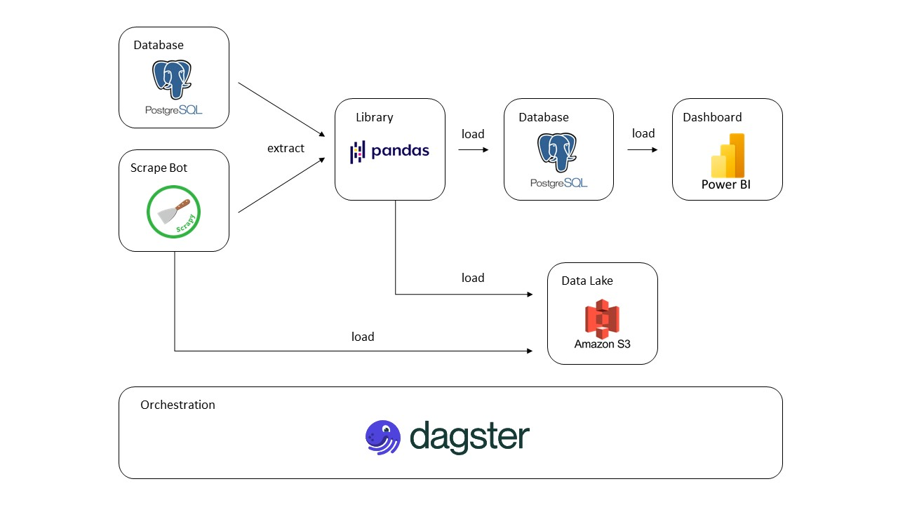

# DE_Project_Group_09 - Analysis Vietnam Jobs
This is our DE project from group 09, Master degree of Data Science K31, HCMUS, Ho Chi Minh, Vietnam.

Our group: Bui Thien Long (21C29008), Nguyen Tran Huu Thinh (21C29018), Bui Thi Hoang Yen (21C29030)

  

In this project, we built a system that includes the following components:
1. Web scraping bot for job recruitments.
2. Processing pipeline.
3. Database (PostgreSQL, DBeaver, Docker).
4. Data Orchestration (Dagster).
5. Data Storage (Amazon S3).
6. Data Analysis (Power BI dashboard).

# Explain folder structure in this repository

In this repository we have 4 main components: Extracting, Transforming, Loading and Visualizing. We used Dagster to create this data platform.

1. Extracting: We will scrawl data from scrape bot to get raw data and extract the old data from the database if it exists.
2. Transforming: We transform raw data into separate cleansed dataframe for reporting by dashboard and load to the data warehouse.
3. Loading: We load the cleansed data to the PostgreSQL and load raw & cleansed ones to the Amazon S3.
4. Visualizing: We use Power BI to connect to PostgreSQL to visualize the data.

